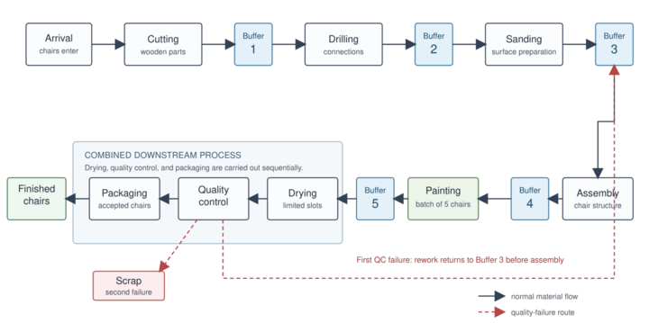

# Simulation-Based Optimisation of a Stochastic Production Line



A discrete-event simulation study of a multi-stage wooden-chair production line. This repository accompanies an academic project on **simulation-based, derivative-free optimisation**: how can a production system be configured efficiently when every candidate solution must be evaluated through a stochastic simulation?

The central question is not only which buffer configuration gives the best result, but also how efficiently different optimisation methods find it under a limited simulation budget.

## Motivation

Production lines consist of connected processing stages, machines, workers, and intermediate buffers. Increasing capacity at one point in the line can be costly and may have little effect if the real bottleneck lies elsewhere.

Experimenting directly on a physical production system is often impractical: reconfiguring equipment or buffers can interrupt production and requires time and money. A discrete-event simulation provides a safe virtual environment for evaluating alternative configurations. The challenge is that the simulator behaves as a **black box**: the objective value is only observed after a simulation run, is affected by randomness, and has no analytical gradient.

This project compares methods that search this black-box problem in different ways.

## Modelled production line

The SimPy model represents the following process:

```text
Arrival → Cutting → Drilling → Sanding → Assembly → Batch painting
        → Drying → Quality control → Packaging
```

The model includes:

- finite buffers between production stages;
- stochastic arrival and processing times;
- limited machines, workers, and drying slots;
- batch painting;
- quality control, one rework opportunity, and scrapping after a repeated failure.

The five intermediate buffer capacities are integer decision variables:

```text
b = (b₁, b₂, b₃, b₄, b₅)
```

They determine the capacities between cutting/drilling, drilling/sanding, sanding/assembly, assembly/painting, and painting/drying.

## Optimisation problem

For a given configuration (b), the simulator estimates mean throughput (ar{T}(b)). The objective balances production performance against the installed buffer capacity:

```math
J(b) = α · T̄(b) − Σᵢ bᵢ
```

The experiments use `α = 20`. Each objective evaluation is based on repeated simulation runs, so simulation noise is reduced through sample averaging.

A function evaluation is therefore the main unit of computational cost: it consists of one candidate configuration evaluated over several stochastic replications.

## Compared methods

| Method | Search strategy | Role in the study |
| --- | --- | --- |
| Grid Search | Evaluates every configuration in a specified grid | Exhaustive reference method for low-dimensional or restricted spaces |
| Finite Difference | Estimates a local improvement direction from neighbouring configurations | Local derivative-free search |
| Bayesian Optimisation | Fits a Gaussian-process surrogate and selects promising candidates using Expected Improvement | Sample-efficient global search |
| Particle Swarm Optimisation (PSO) | Moves a population of interacting particles through the search space | Population-based global search |

Two experiment settings are included:

- **2D diagnostic comparison:** only buffers 3 and 4 vary; the other buffers remain fixed at `(5, 5, 5, 5, 5)`. This setting makes the objective landscape and method behaviour easy to inspect visually.
- **5D optimisation:** all five buffer capacities are optimised simultaneously. This reflects the full simulation-optimisation problem and illustrates why exhaustive search becomes expensive as dimensionality grows.

For example, allowing 20 values for each of five buffers yields (20^5 = 3,200,000) possible configurations before accounting for repeated stochastic replications.

## Repository structure

```text
src/
├── simulation/
│   └── production_line.py              # SimPy production-line model and run_simulation()
└── optimization/
    ├── grid_search.py                  # 5D Grid Search
    ├── finite_diff.py                  # 5D Finite Difference
    ├── bayesian_optimisation.py        # 5D Bayesian Optimisation
    ├── pso.py                          # 5D Particle Swarm Optimisation
    └── 2d_implementations/
        ├── grid_search_2d.py
        ├── finite_difference_2d.py
        ├── bayesian_optimisation_2d.py
        └── pso_2d.py
docs/
└── images/production_line.png           # Production-line diagram
results/                                 # Generated CSV files and figures (not versioned)
requirements.txt
```

## Installation

Run the following commands from a terminal:

```bash
git clone https://github.com/moskvamanch/production-optimization.git
cd production-optimization

python -m venv .venv
source .venv/bin/activate               # Windows: .venv\Scripts\activate

python -m pip install --upgrade pip
python -m pip install -r requirements.txt
```

Python 3.10 or newer is recommended. The project depends on SimPy, NumPy, pandas, Matplotlib, SciPy, and scikit-learn.

## Running the experiments

Always run the commands below from the repository root. The `-m` form preserves the package imports used by the scripts.

### Start with the 2D comparison

These entry points use the same production-line model and objective, while varying only buffers 3 and 4. Each script writes a CSV file and, where applicable, figures to `results/`.

```bash
python -m src.optimization.2d_implementations.grid_search_2d
python -m src.optimization.2d_implementations.finite_difference_2d
python -m src.optimization.2d_implementations.bayesian_optimisation_2d
python -m src.optimization.2d_implementations.pso_2d
```

The default 2D scripts use five replications per evaluation and capacities from 1 to 10. Bayesian Optimisation and Finite Difference use an evaluation budget of 66; PSO uses six particles over ten iterations.

### Run the 5D methods

```bash
python -m src.optimization.finite_diff
python -m src.optimization.bayesian_optimisation
python -m src.optimization.pso
```

The experiment parameters are deliberately explicit in each script’s `if __name__ == "__main__":` block. Adjust the buffer range, number of replications, evaluation budget, or random seed there before running a new study.

### Important note on 5D Grid Search

The five-dimensional Grid Search is computationally intensive. Its default configuration covers (10^5) buffer combinations, with repeated simulations and a validation step.

Before running it, open `src/optimization/grid_search.py` and set:

```python
RUN_FULL_SEARCH = False
```

Then run:

```bash
python -m src.optimization.grid_search
```

This performs a small runtime benchmark rather than the full search. Set `RUN_FULL_SEARCH = True` only when you intentionally want to start or resume the exhaustive experiment. Results are checkpointed so an interrupted search can continue with matching settings.

## Reproducibility and output

The optimisation scripts expose random seeds and simulation parameters directly in their configurations. Results include the evaluated buffer capacities, objective value, mean and standard deviation of throughput, number of function evaluations, and number of simulation runs.

Generated raw CSV files, checkpoints, and plots are intentionally excluded from version control. This keeps the repository focused on the model and reproducible experiment code; selected figures can be placed in `docs/` when needed.

## Scope and limitations

This is a research and learning project rather than a production scheduling system. Its purpose is to compare optimisation behaviour under a controlled, stochastic simulation model. Results depend on the simulation horizon, replication count, seeds, search bounds, and evaluation budget.

The repository does not claim that one optimiser is universally best. Instead, it highlights the practical trade-off between solution quality, stochastic variability, and the number of expensive simulation evaluations required to find a good configuration.
